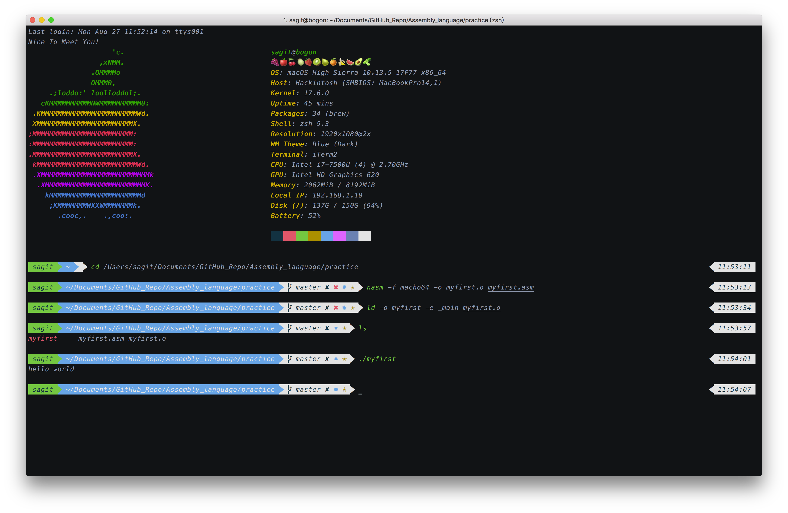

# Assembly_language
My Assembly Language Learning

# Compiler 
[Nasm](https://www.nasm.us/)

# Steps
### Linux
```bash
nasm -f elf source_file
gcc -o targer_file souece_file_name.o
./target_file
```

### macOS
- Install Package Manager Tool -- ` brew `(optional)
Open ` Terminal ` and enter the following command:
```bash
/usr/bin/ruby -e "$(curl -fsSL https://raw.githubusercontent.com/Homebrew/install/master/install)"
```
- Install Compiler  -- ` Nasm `
```bash
brew install nasm
```

- Compile Source Code

```bash
nasm -f macho64 -o file_name.o file_name.asm
ld -o file_name -e _main file_name.o
./file_name
```

